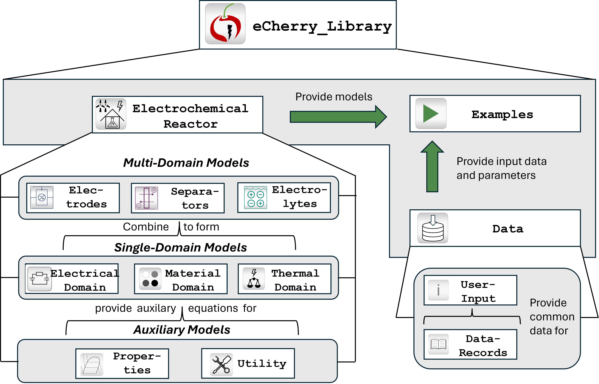
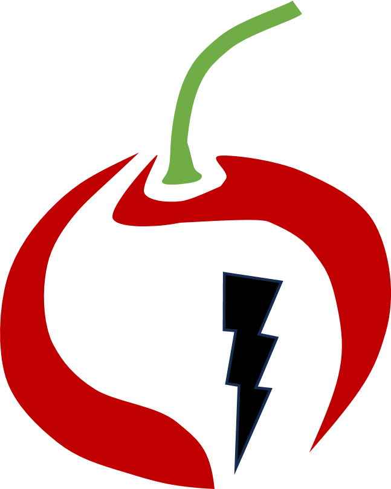

# eCherry public version
 Welcome to eCherry, a modelica library to model electrochemical systems.
 In this repository you will find all the parts to build your own model of an electrochemical reactor or electrolyzer.
Additionally, you will also find multiple working examples. 

  

eCherry is in active development and over time we will add more features and a detailed documentation to aid the user.
Don't be surprised that there are few commits here, the development is happening in a private repo.

# publication (useful first explanation)
The structure and theoretical underpinnings have been published in Electrochemical Science Advances (ELSA).
We tried to break it down, visualize it nicely and it is open access - so give it a look: [https://doi.org/10.1002/elsa.202400030](https://doi.org/10.1002/elsa.202400030)

#compatibility
eCherry was developed and tested with Dymola 2023x. However, we tested all systems model also with OpenModelica and going forward want to write all models as compatible with both

# getting started
If you want to use eCherry: [how to get started](https://gitlab.git.nrw/rwth-avt-svt/public/echerry/-/wikis/Getting-Started).
Further explanation can be found in the [wiki](https://gitlab.git.nrw/rwth-avt-svt/public/echerry/-/wikis/home).

# questions & contact
We think (modeling) code should be open and should be discussed. 
If you have any questions/comments: write a ticket or mail us at: electrochemistry.SVT@avt.rwth-aachen.de
eCherry's next version is already in the making.

# license

===============================================================

(c) Lehrstuhl fuer Systemverfahrenstechnik/Prozesstechnik, RWTH Aachen 

===============================================================

eCherry has been developed and is under continuous development at AVT.SVT (RWTH Aachen). 
We are grateful for 
funding from DFG, EU and BMBF that have contributed directly or indirectly to eCherry.

This program is free software: you can redistribute it and/or modify
it under the terms of the GNU General Public License as published by
the Free Software Foundation, either version 3 of the License, or
(at your option) any later version.

This program is distributed in the hope that it will be useful,
but WITHOUT ANY WARRANTY; without even the implied warranty of
MERCHANTABILITY or FITNESS FOR A PARTICULAR PURPOSE.  See the
GNU General Public License for more details.

You should have received a copy of the GNU General Public License
along with this program.  If not, see http://www.gnu.org/licenses/.

